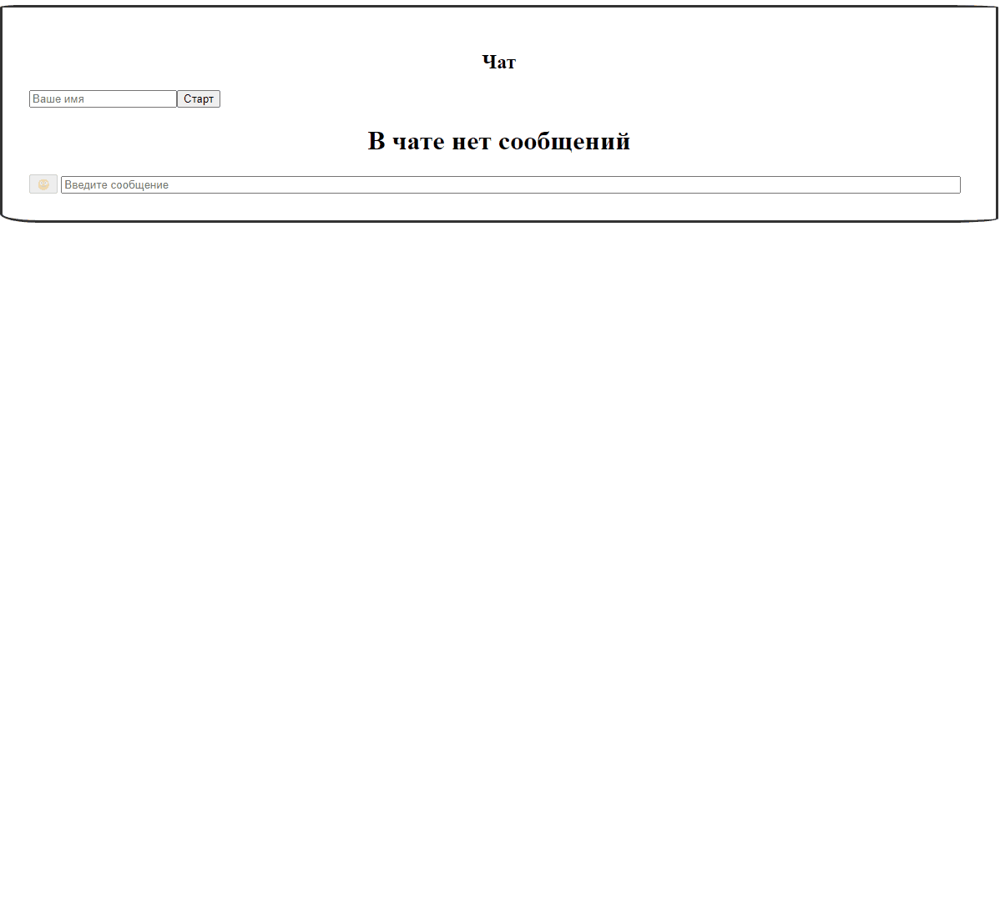

<br/>
<p align="center">
  <h3 align="center">Chat</h3>
  <p align="center">
    Typescript приложение чата реализованное при помощи Redux на базе Firebase API.
    <br/>
    <br/>
  </p>
</p>

[](https://github.com/SergeyAkkuratov/OTUS_homework_lesson34/actions/workflows/pull_request_check.yml)
 


## Содержание

-   [О проекте](#о-проекте)
-   [Установка](#установка)
-   [Использование](#использование)

## О проекте



Приложение чат позволяет обмениваться сообщенияими с другими пользователями, которые также подключились к данному приложению.  
Обмен сообщениями осуществляется при помощи Firebase API.  
Чат позволяет задавать пользователю любой текстовый никнейм и посылать небольшой набор самйликов.

## Требования

Для локального запуска приложения вам потребуется [npm](https://docs.npmjs.com/downloading-and-installing-node-js-and-npm).

## Установка

Для локального запуска приложения вам нужно склонировать проект, скачать зависимости и скрипт запуска:

```bash
git clone https://github.com/SergeyAkkuratov/OTUS_homework_lesson47.git ./outlays

cd ./outlays

npm install

npm start

```

Приложение будет доступно по адресу http://localhost:8080/.

Так же попробовать приложение можно [онлайн](https://sergeyakkuratov.github.io/OTUS_homework_lesson34/).

## Использование

-   При открытии приложения вы увидите поле "Ваше имя" - в него можно внести любой текстовый никнейм для индетификации вас в сообщениях чата.
-   Для того, чтобы начать общение - нажмите кнопку старт.
-   В поле внизу приложения вы можете печатать свои сообщения и отправлять их по нажатию кнопки Enter.
-   Рядом с полем ввода сообщения есть кнопка смайликов, нажатие на неё откроет дополнительное окно, где вы можете выбрать смайлик, при клике на которой он поместится в текст вашего сообщения.
-   если вы хотите отключиться от чата но не закрывать окно приложения, вы можете нажать кнопку "Стоп".
